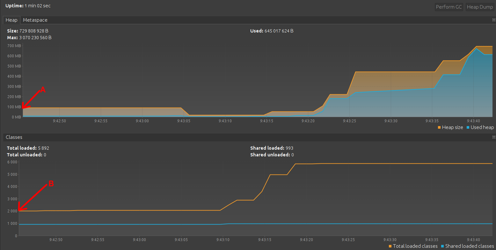
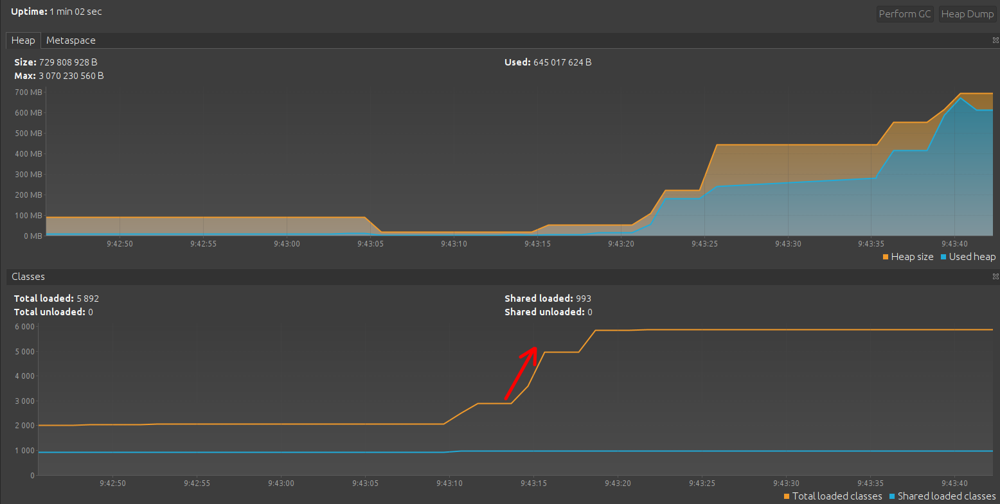
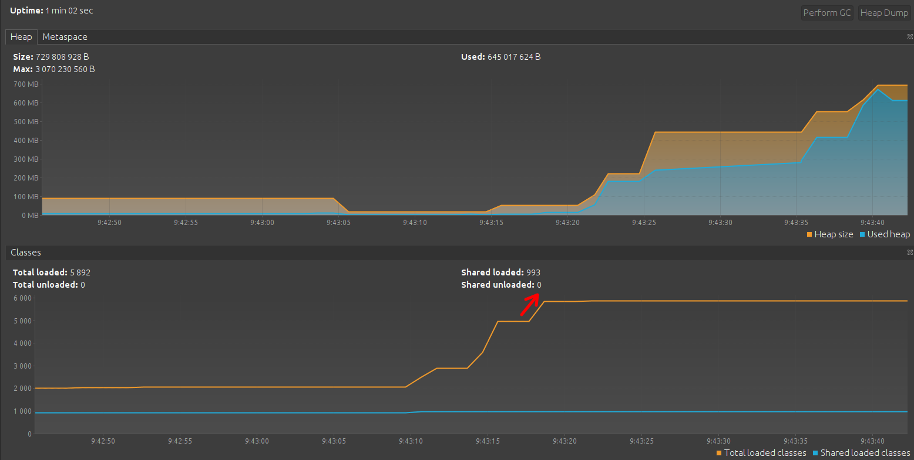
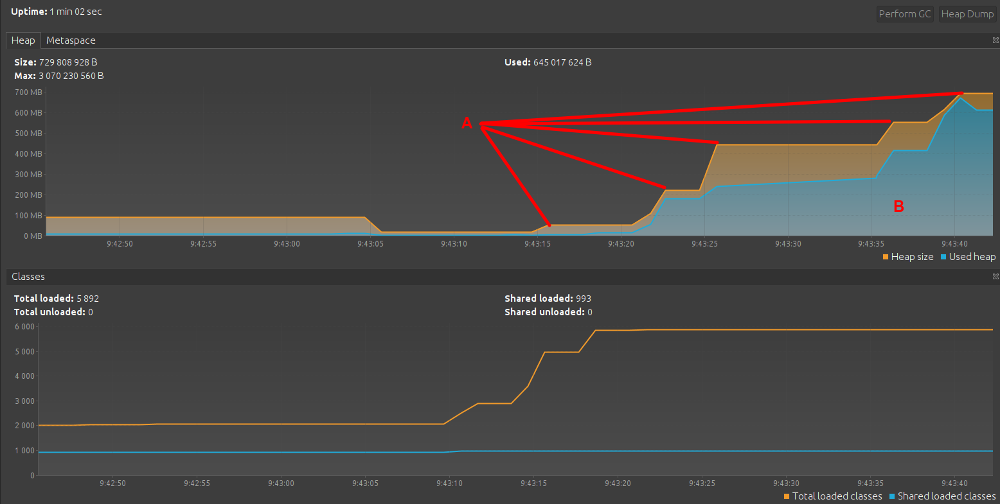
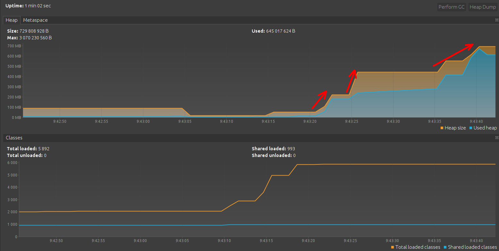

Домашнее задание для Netology.ru для курса Java Developer

Описание и инструкция к выполнению [здесь](https://github.com/netology-code/jd-homeworks/tree/master/jvm/README.md)

## Решение

* Выделение области памяти для Heap (A)
* Выгрузка совместно используемых классов (В)
  
* Сборщик мусора уменьшает размер выделенной памяти
  
* Загрузка классов из пакета в Metaspace

``` css
  loading io.vertx
  loaded 529 classes
  ``` 


``` css
  loading io.netty
  loaded 2117 classes
  ``` 



``` css
  loading org.springframework
  loaded 869 classes
  ``` 



* Увеличение памяти в куче
    * А - выделенная память
    * В - используемая память
      
* Создание объектов к куче
  
* Работа сборщика мусора
  
* Завершение программы